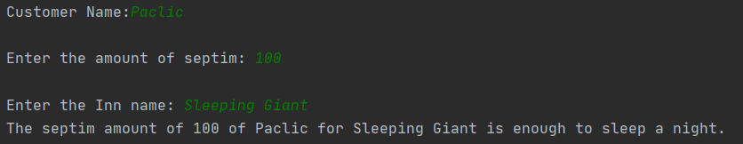

## TMPS Laboratory Work Nr.2

### Prerequisites:
  - Design patterns
  - Structural design patterns
  - Organize and structure the application using structural design patterns.

### Objectives:
  - Study structural design patterns
  - Develop a project using 5 structural design patterns
  - Ensure connection between patterns
 
 ### Tasks: 
 -  Create an application using 3 design structural patterns : 
    - Adapter
    - Bridge
    - Composite
    - Flyweight
    - Decorator 
    - Facade
    - Proxy
    
 ### Implementation of task: 
 
 In this laboratory work I have continued to work on the first laboratory and study about Design Patterns, but this time about **Structural**. The structural design patterns are concerned with how classes and objects arecomposed to form larger structures.Structural class patterns use inheritance to compose interfacesor implementations. In this case imagine how to combine the multiple inheritance mixes many classes into one. A result is a class that combines the properties of its parent classes. 
 
 So let's analyze the Strucutural patterns implementation according to my application. 
 
  ### Adapter
 
 The adapter pattern provides an interface , which perform a uniform abstractization of different interfaces. The classes that working with Adapter pattern should work together because this have the same interface. All of the design pattern come to solve an problem , structural , creatioal or behavioral. So, the adapter we should use then : 
 - you need to use several subclasses for an object , but it's not good, because you should have an interface for each object from subclass.
 - ensure the good communication between interfaces and objects. 
 In my case I used this pattern to create an inn, you give it an amount of septims and it cheks if they are enough for the inn.
 
 //
package domain.RiverwoodInn_adapter;

public interface Interface {
    public void giveInnDetails();
    public String getSeptimAmount();
}
//
package domain.RiverwoodInn_adapter;

public class InnDetails{
    private String innName;
    private String customerName;
    private long accNumber;

    public String getInnName() {
        return innName;
    }
    public void setInnName(String innName) {
        this.innName = innName;
    }
    public String getCustomerName() {
        return customerName;
    }
    public void setCustomerName(String customerName) {
        this.customerName = customerName;
    }
    public long getCustomerAmount() {
        return accNumber;
    }
    public void settCustomerAmount(long accNumber) {
        this.accNumber = accNumber;
    }

#The Result:

### Decorator 
A Decorator Pattern says that just "attach a flexible additional responsibilities to an object dynamically".
In other words, The Decorator Pattern uses composition instead of inheritance to extend the functionality of an object at runtime.
In my case I used decorator pattern to create an alcehmist who sells potions.

package domain.Potions_decorator;

public interface Potions {
    public String preparePotions();
    public double potionPrice();
}
package domain.Potions_decorator;

public class Invisibility implements Potions {
    public String preparePotions() {
        return "Invisibility Potion";
    }

    public double potionPrice() {
        return 500.0;
    }
}
package domain.Potions_decorator;

public abstract class Alchemy implements Potions{
    private Potions newPotion;
    public Alchemy(Potions newPotion)  {
        this.newPotion=newPotion;
    }
    @Override
    public String preparePotions(){
        return newPotion.preparePotions();
    }
    public double potionPrice(){
        return newPotion.potionPrice();
    }
}
#The result:

### Facade
A Facade Pattern says that just "just provide a unified and simplified interface to a set of interfaces in a subsystem, therefore it hides the complexities of the subsystem from the client".In other words, Facade Pattern describes a higher-level interface that makes the sub-system easier to use. 
In my case I used it to create a weapon shop.
package domain.Weapons_facade;

public interface WeaponShop {
    public void WeaponType();
    public void price();
}
package domain.Weapons_facade;

public class Merchant {
    private WeaponShop OneHanded;
    private WeaponShop TwoHanded;
    private WeaponShop Archery;

    public Merchant(){
        OneHanded= new OneHanded();
        TwoHanded=new TwoHanded();
        Archery=new Archery();
    }
    public void OneHandedSale(){
        OneHanded.WeaponType();
        OneHanded.price();
    }
    public void TwoHandedSale(){
        TwoHanded.WeaponType();
        TwoHanded.price();
    }
    public void ArcherySale(){
        Archery.WeaponType();
        Archery.price();
    }
}
#The Result:
 

