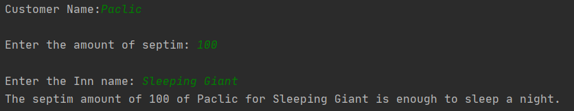

# Author: Cerlat Pavel FAF-192

#  Prerequisites:

- Design patterns
- Creational design patterns
- Structure the project using design patterns

## Objectives:

- Study creational design patterns
- Develop a project using 5 creational design patterns
- Ensure connection between patterns

## Tasks:

- Create an application using at least 3 design creational patterns :
   - Builder
   - Abstract Factory
   - Factory
   - Singleton
   - Prototype

##  Implementation of task:
In general this code just creates an Elder Scrolls V Skyrim character which can be a Redguard or a Nord, he has one of the 4 classes which depends on his race and an atronach
which can be of 2 types Flame and Storm.Before starting performing this laboratory work I have studied about design patterns and what is the purpose of usign them into some projects, what are advantages. Also, I have studied each design pattern and I have tried to understand how it works.

## Builder pattern

It is creational design pattern which operate with creating the complex objects and we need to use when the process involved in creating an object is extremely complex, with lots of mandatory and optional parameters.

## Singleton

Singleton helps me create the instance of redguard and nords which means that they are created only once, when requested, and I can access it from anywhere in my program whenever I need

class Redguard implements PlayableRace {
    private static Redguard redguard = null;
    public static Redguard getInstance() throws IOException {
        if (redguard == null) {
            synchronized (Dovahkiin.class) {
                if (redguard == null) {
                    redguard = new Redguard();
                }
            }
        }
        return redguard;
    }
    
 class Nord implements PlayableRace {
    private static Nord nord = null;

    public static Nord getInstance(){
        if (nord == null) {
            synchronized (Dovahkiin.class) {
                if (nord == null) {
                    nord = new Nord();
                }
            }
        }
        return nord;
        
        
## Prototype

Prototype pattern I used for my Atronach class. I have created the Atronach class which has a method that gives it a name and every time I want to add a new Atronach, I just clone the original Atronach and I give him a new name.

public class Atronach {
    private static String name;

    public Atronach(String name) {
        Atronach.name = name;
    }

    public Atronach clone(String name){
        Atronach newAtronach = null;
            newAtronach = new Atronach(name);
        return newAtronach;
    }
}
## Abstract Factory

Abstract Factory Pattern defines an interface or abstract class for creating families of related (or dependent) objects but without specifying their concrete sub-classes.That means Abstract Factory lets a class returns a factory of classes.
Factory Method and Abstract Factory for example if I want to create a redguard race, I call  race and I am getting the singleton instances of redguards that I have previously created and add them to the corresponding redguard class(Assasin or Hunter).

import java.io.IOException;
public final class Races {

    public static PlayableRace add_race(String race) throws IOException {
        switch (race){
            case "redguard": return Redguard.getInstance();
            case "nord": return Nord.getInstance();
            default: return null;
        }
    }
    
class Assassin implements Classes {
    public Assassin() {
        System.out.println("Assassin created");
    }
}

## TMPS Laboratory Work Nr.2

### Prerequisites:
  - Design patterns
  - Structural design patterns
  - Organize and structure the application using structural design patterns.

### Objectives:
  - Study structural design patterns
  - Develop a project using 5 structural design patterns
  - Ensure connection between patterns
 
 ### Tasks: 
 -  Create an application using 3 design structural patterns : 
    - Adapter
    - Bridge
    - Composite
    - Flyweight
    - Decorator 
    - Facade
    - Proxy
    
 ### Implementation of task: 
 
 In this laboratory work I have continued to work on the first laboratory and study about Design Patterns, but this time about **Structural**. The structural design patterns are concerned with how classes and objects arecomposed to form larger structures.Structural class patterns use inheritance to compose interfacesor implementations. In this case imagine how to combine the multiple inheritance mixes many classes into one. A result is a class that combines the properties of its parent classes. 
 
 So let's analyze the Strucutural patterns implementation according to my application. 
 
  ### Adapter
 
 The adapter pattern provides an interface , which perform a uniform abstractization of different interfaces. The classes that working with Adapter pattern should work together because this have the same interface. All of the design pattern come to solve an problem , structural , creatioal or behavioral. So, the adapter we should use then : 
 - you need to use several subclasses for an object , but it's not good, because you should have an interface for each object from subclass.
 - ensure the good communication between interfaces and objects. 
 In my case I used this pattern to create an inn, you give it an amount of septims and it cheks if they are enough for the inn.
 
 //
package domain.RiverwoodInn_adapter;

public interface Interface {
    public void giveInnDetails();
    public String getSeptimAmount();
}
//
package domain.RiverwoodInn_adapter;

public class InnDetails{
    private String innName;
    private String customerName;
    private long accNumber;

    public String getInnName() {
        return innName;
    }
    public void setInnName(String innName) {
        this.innName = innName;
    }
    public String getCustomerName() {
        return customerName;
    }
    public void setCustomerName(String customerName) {
        this.customerName = customerName;
    }
    public long getCustomerAmount() {
        return accNumber;
    }
    public void settCustomerAmount(long accNumber) {
        this.accNumber = accNumber;
    }
}
#The Result:

